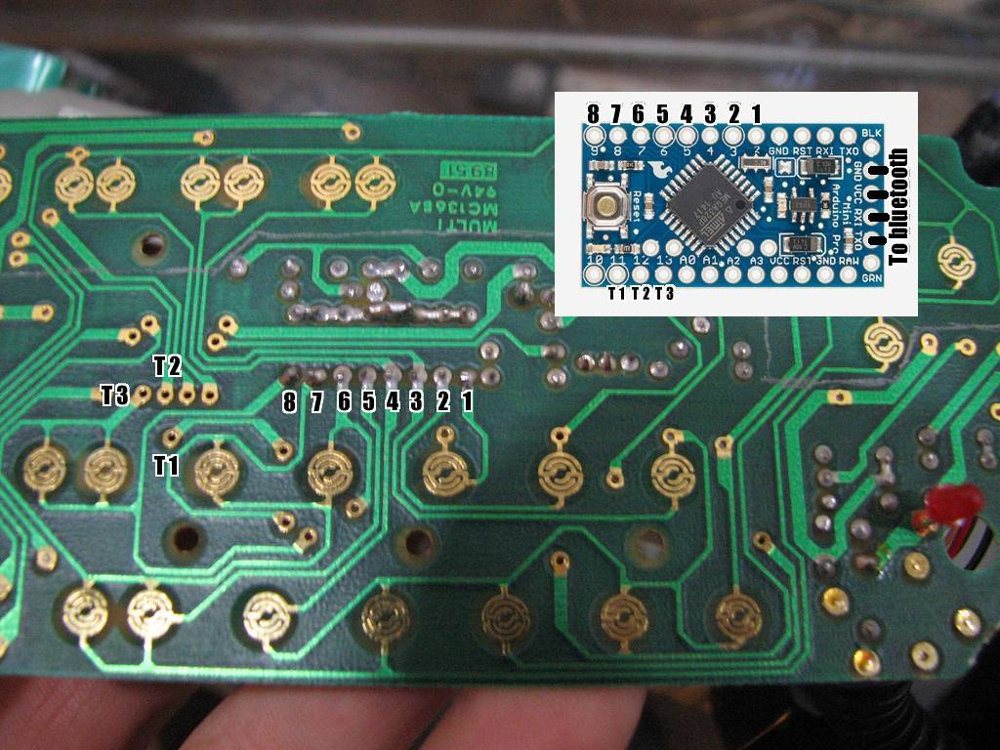

# bluetooth-powerglove
Arduino based BlueTooth interface for the Nintendo Power Glove

I made this because i wanted to use my Power Glove as a function keyboard
stuff like music control and some extras from the Glove via bluetooth so i could use it with either my computer or my phone

I used an Arduino Mini Pro and an RN-42 bluetooth module
I used the standard Keypad.h library to map the glove buttons as a keypad (this prevents multiple buttons from being sent at the same time)
The glove has 20 buttons total (Center and 0 are the same button inside the glove)
I personally didn't touch the flex sensors in the glove because my main interest was a bluetooth function keyboard, but if desired they could be connected to the analog pins in the Arduino which i left free

I decided to put a LED in the glove as well, and since I wanted it to fade in and out i had to leave pin 10 free for it
Also note that Arduino Mini Pro has a LED on pin 13, I had to remove it or else the program would get stuck on a button press

